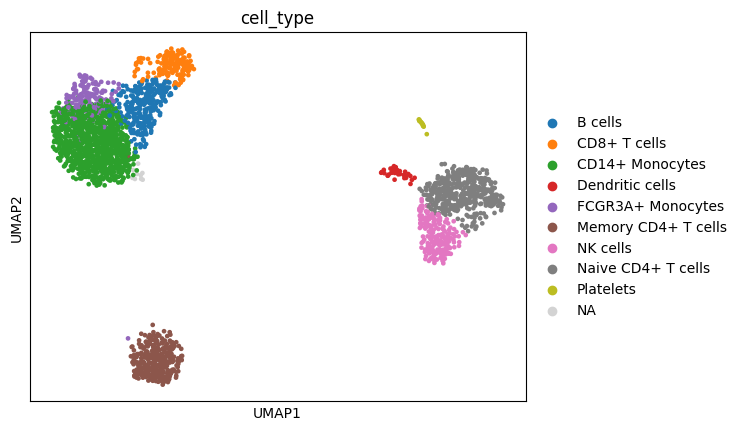

#  PBMC 3k Single-Cell RNA-Seq Analysis

This project performs an end-to-end single-cell RNA sequencing analysis of the **PBMC 3k dataset** using Python and the `scanpy` package. It includes preprocessing, dimensionality reduction, clustering, annotation, marker gene identification, and data visualization.

---

##  Project Structure

```
scRNAseq_Project/
├── data/
│   └── raw/                      # Raw input files (e.g., pbmc3k.h5ad)
├── notebooks/
│   └── pbmc3k_analysis.ipynb     # Main notebook with all analysis steps
├── results/
│   ├── pbmc3k_processed.h5ad     # Saved AnnData object
│   └── marker_genes_by_cluster.csv
├── figures/
│   └── Plots saved by Scanpy (e.g., UMAP, violin, dotplot)
├── scripts/
│   └── download_pbmc3k.py        # Script to download the dataset
└── README.md                     # Project description
```

---

##  Technologies Used

- Python 3.10+
- Jupyter Notebook
- Scanpy
- AnnData
- matplotlib & seaborn
- pandas & numpy

---

##  Analysis Workflow

###  Step 1: Load Dataset
- Read the PBMC 3k dataset using `scanpy.datasets.pbmc3k()` or from a local `.h5ad` file

###  Step 2: Preprocessing
- Filter low-quality cells and genes
- Normalize and log-transform the data
- Identify highly variable genes
- Scale data and run PCA

###  Step 3: Dimensionality Reduction & Clustering
- Construct a neighborhood graph
- Perform Leiden clustering
- Visualize using UMAP

###  Step 4: Cell Type Annotation
- Annotate clusters with known immune cell types
- Visualize annotated cell types on UMAP

###  Step 5: Marker Gene Detection
- Rank marker genes for each cluster
- Visualize markers using heatmaps, violin plots, and dotplots

###  Step 6: Save Outputs
- Export processed data (`.h5ad`)
- Save plots and marker gene tables to `results/` and `figures/`

---

##  Sample Output



> UMAP plot of PBMC clusters annotated by cell type

---

## ️ How to Reproduce

1. Clone the repository:
   ```bash
   git clone https://github.com/munaberhe/pbmc3k-analysis.git
   cd pbmc3k-analysis
   ```

2. Create and activate the conda environment:
   ```bash
   conda create -n scRNAseq_env python=3.10 -y
   conda activate scRNAseq_env
   pip install scanpy jupyter matplotlib seaborn pandas numpy scikit-learn
   ```

3. Download the dataset:
   ```bash
   python scripts/download_pbmc3k.py
   ```

4. Launch the notebook:
   ```bash
   jupyter notebook notebooks/pbmc3k_analysis.ipynb
   ```

---

##  References

- [10x Genomics PBMC 3k Dataset](https://support.10xgenomics.com/single-cell-gene-expression/datasets)
- [Scanpy Documentation](https://scanpy.readthedocs.io)
- [Wolf et al., 2018 - SCANPY: Large-scale single-cell gene expression data analysis](https://www.nature.com/articles/s41592-018-0229-2)

---

##  Contact

**Muna Berhe**  
 GitHub: [@munaberhe](https://github.com/munaberhe)

---

